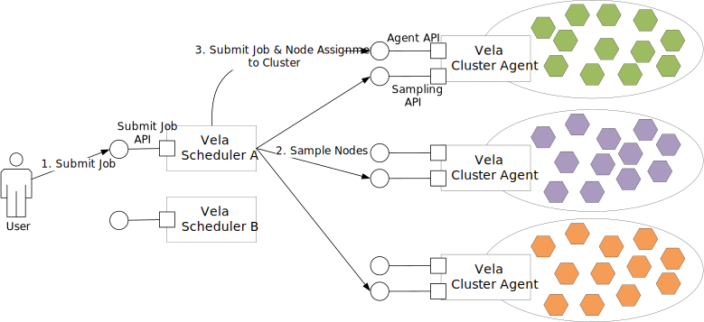

# Vela Scheduler

Vela Scheduler is an orchestrator-independent distributed scheduler for the Edge-to-Cloud continuum.

The Edge-to-Cloud continuum may span hundreds of thousands of nodes and can be formed of multiple Edge and Cloud clusters, which may be operated by different orchestrators, e.g., one cluster could be managed by [Kubernetes](https://kubernetes.io) and another one by [Nomad](https://www.nomadproject.io).
Vela Scheduler can be run as an arbitrary number of instances.
To be compatible with the Vela Scheduler, each cluster must run the Vela Cluster Agent, which is the only interface needed by the scheduler to interact with the cluster.

The high-level scheduling workflow of Vela Scheduler is depicted in the diagram above. 
A user or a system component submits a job to an arbitrary scheduler instance through its Submit Job API, which adds this job to the scheduler’s queue.
Once dequeued, the job enters the scheduling pipeline, which begins by obtaining a sample of candidate nodes from every cluster.
To this end, the scheduler contacts the Vela Cluster Agent in each cluster and sends it the description of the job to be scheduled.
Using the Cluster Agent prevents the scheduler from having to communicate with each node directly. For each node picked by the sampling algorithm, the Cluster Agent performs initial filtering and scoring, i.e., it determines if the node meets the requirements set forth by the received job description and assigns a score to each node that passes filtering to indicates how well it is suited for the job.
The list suitable nodes along with their scores is returned to the scheduler.
The scheduler may run additional filtering and scoring steps and subsequently chooses the node with the highest score.
Finally, the scheduler submits the job to the Cluster Agent that is responsible for the chosen node to deploy the job.

## Documentation

The documentation for the Vela Scheduler is available in the [docs](./docs) folder.

### Repository Organization

This project is realized in Go 1.19 and relies on Go workspaces to divide code into multiple modules.

| Directory                | Contents |
|--------------------------|----------|
| [`deployment`](./deployment) | Configuration files for deploying Vela Scheduler and Vela Cluster Agent |
| [`docs`](./docs) | Documentation files (Work in progress) |
| [`go`](./go) | Go workspace containing all Vela Scheduler modules |
| [`go/cluster-agent`](./go/cluster-agent) | The polaris-cluster-agent executable module |
| [`go/context-awareness`](./go/context-awareness) | Context-aware scheduling plugins  |
| [`go/framework`](./go/framework) | The orchestrator-independent Vela Scheduler framework library that defines the scheduling pipeline and plugin structures. |
| [`go/k8s-connector`](./go/k8s-connector) | Kubernetes orchestrator connector |
| [`go/scheduler`](./go/scheduler) | Vela Scheduler executable module |
| [`testbed`](./testbed) | Scripts and configurations for setting testbeds for experimenting with Vela Scheduler |

## Acknowledgement

Vela Scheduler is a fork and evolution of the rainbow-scheduler the [orchestration repository](https://gitlab.com/rainbow-project1/rainbow-orchestration) of the [RAINBOW](https://rainbow-h2020.eu/) project.

