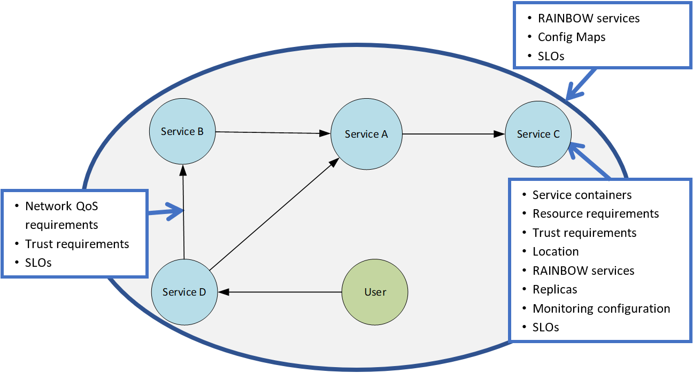

# Polaris Scheduler Documentation

## Components

The polaris-scheduler consists of the following components:

* **polaris-scheduler**: fog-aware Kubernetes scheduler.
* **Service Graph**: a Kubernetes CRD to allow modelling a microservice-based application with all its dependencies and network QoS requirements.
* **Node Topology Graph**: a Kubernetes CRD to model the cluster and the network link qualities among the nodes.

## Service Graph

The Service Graph is an abstraction that captures a fog application as a complete entity, with all the information needed to deploy and run all its services and maintain the desired quality of service and SLOs.
It allows to not only model a fog application, but to use that model to deploy and manage the entire lifespan of the application and the ability to specify network QoS constraints and arbitrary SLOs that will be maintained at runtime.

The Service Graph is a Directed Acyclic Graph (DAG).
It consists of nodes and directed links (we prefer to avoid the term “edges” to evade confusion with the “network edge” in Edge Computing).
As shown in the Figure below, each element of the Service Graph and the entire graph itself supports a set of annotations to specify properties, such as container images, constraints, or SLOs.

The annotations on the nodes allow specifying which containers the service consists of, what resources they require, if they can only run on a specific type of node or in certain locations, and any SLOs that need to be maintained for them.

The link annotations allow the definition of network quality constraints and are automatically translated to network SLOs.

Finally, the annotations for the Service Graph itself allow the the definition of Config Maps that can be mounted as configuration files into service containers and SLOs that apply to the application as a whole.

Examples of a `Service Graphs` can be found [here](../go/orchestration/config/samples/fogapps_v1_servicegraph.yaml) and [here](../go/orchestration/config/samples/fogapps_v1_servicegraph.yaml).

## Node Topology Graph

Polaris-scheduler needs to know the node topology graph of the cluster.
For this graph, the set of nodes and links are stored separately:

* The set of nodes is the standard list of Nodes obtainable through the Kubernetes API.
* The set of links uses the [NetworkLink CRD](../go/orchestration/apis/cluster/v1/networklink_types.go).

Both lists together can be used to construct a node topology graph.
The advantage of not storing one big node topology graph CRD is that the graph's elements can be updated separately whenever new metrics are available.

Each `NetworkLink` connects two nodes that have a direct network connection to each other.
In the CRD there are two fields `nodeA` and `nodeB`, which refer to the names of these nodes.
Each link `nodeA <-> nodeB` exists only once - the admission webhook generates the name of a link automatically by sorting the two node names alphabetically and concatenating them, thus, ensuring that a link with `nodeA` and `nodeB` swapped is not stored as a duplicate. 

An example of a set of `NetworkLinks` can be found [here](../go/orchestration/config/samples/cluster_v1_networklink.yaml).
