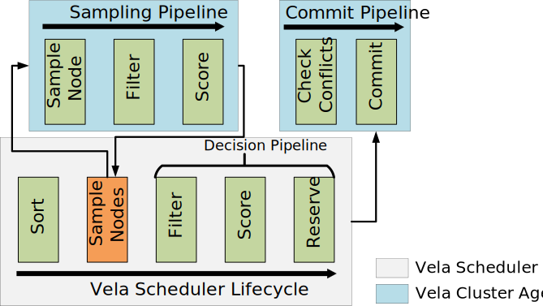

# Polaris Scheduler Documentation

This documentation provides a quick overview of the Polaris Scheduler and its deployment.

## Architecture

The high-level architectures of Polaris Scheduler and the Polaris Cluster Agent are shown in the diagram below.
Both consist of the following three major layers:

1. The *Polaris Scheduler Framework* in the middle provides the object model and runtime services. It realizes the generic scheduling and sampling pipelines. To promote flexibility, sampling, filtering, and scoring policies need to be implemented as plugins.
2. The *orchestrator-specific Connectors* at the bottom are used by the generic components in the upper layers.
3. The *plugins* in the top layer realize scheduling and sampling policies.

The central part of the architectures is the Polaris Scheduler Framework.
All of its components are completely orchestrator-independent and only the Orchestrator Client needs to be realized by an orchestrator-specific connector.
The Object Model provides abstractions, e.g., for nodes and jobs. The Submit Job API exposes an orchestrator-independent endpoint to submit new jobs to a scheduler instance. The Agent API of the Cluster Agent is used by the scheduler to communicate with the Cluster Agent and presents the only interface for the scheduler to a cluster.
It provides endpoints for sampling nodes and submitting scheduling decisions and may be expanded in the future to provide further endpoints for retrieving additional cluster information.
The Polaris Scheduler Runtime powers the scheduling process, sets up the API and pumps jobs into the scheduling pipeline.
The Sampling Service serves an analogous purpose with respect to the sampling pipeline. The Nodes Cache is used by the Cluster Agent to cache information about the nodes in its cluster.
It is updated at a high frequency, preferably through an event-based change notification mechanism if the underlying orchestrator supports it, to ensure that its information reflects the current state of the cluster.

## Scheduling and Sampling Pipelines

The Scheduling Pipeline forms the centerpiece of the Polaris Distributed Scheduler and defines the scheduling and decision-making process.
The pipeline consists of a sequence of stages, as shown in the above diagram, whose business logic is realized by plugins, which enables the realization of different scheduling polices.
The Sort and Sample Nodes stages support only a single plugin each, while the other stages support multiple plugins.

## Deployment

The [deployment](../deployment) directory of this repository contains configuration files to configure and deploy Polaris Scheduler and the Polaris Cluster Agent.
Copy the contents of this directory to a working directory and adapt the configuration files as needed.

### Polaris Cluster Agent

For the Cluster Agent we currently provide an implementation with the Kubernetes connector and [deployment files](../deployment/cluster-agent/kubernetes) for it.
To deploy the agent in a cluster, adapt the `1-config-map.yaml` file and then run `kubectl apply -f ./` in the same folder.

### Polaris Scheduler

Since Polaris Scheduler is completely orchestrator-independent, we provide a docker-compose file for easy deployment of a single instance [here](../deployment/scheduler).
Adapt the YAML configuration file in this directory to your needs - the default configuration will work fine in most cases, but you must configure the list of clusters in the `remoteClusters` object.
